# 14.2: Big O Notation — Measuring Algorithm Efficiency

---

## 🎯 Learning Objectives

By the end of this section, you will be able to:

- Explain what Big O notation measures (growth rate, not speed)
- Identify common Big O complexities: O(1), O(log n), O(n), O(n log n), O(n²)
- Determine the Big O of simple algorithms
- Understand why O(n²) algorithms become unusable for large inputs

---

## 🧭 The Big Picture

> You need to send a message to everyone in your class of 30. You have three options:
> - **O(1):** Post one message to the class group — 1 operation regardless of how many people are in the group
> - **O(n):** Message each person one by one — 30 messages
> - **O(n²):** Have everyone message everyone else to confirm receipt — 30 × 30 = 900 messages
>
> Big O notation describes how the **number of operations grows** as the input size grows. It doesn't measure speed in seconds — it measures the **rate of growth**. An O(1) algorithm stays constant no matter the input. An O(n²) algorithm becomes impractically slow as n grows.

---

## 📚 Core Content

### What Big O Measures

Big O notation describes the **worst-case** number of operations an algorithm performs as the input size grows.

```
O(1)     → Constant:     Doesn't grow with input size
O(log n) → Logarithmic:  Grows slowly, doubles input adds 1 step
O(n)     → Linear:       Grows at the same rate as input
O(n log n) → Linearithmic: Common for efficient sorting
O(n²)    → Quadratic:    Grows with the square of input — slow!
O(2ⁿ)    → Exponential:  Grows explosively — avoid!
```

### The Big O Cheatsheet



### O(1) — Constant Time

The algorithm takes the same number of steps regardless of input size:

```c
// Array access — always 1 step, no matter how large the array
int get_first(int arr[]) {
    return arr[0];
}

// Hash table lookup — O(1) average case
struct Entry *table[100];
// table[hash("France")] → instant access
```

### O(log n) — Logarithmic Time

The algorithm cuts the problem in half each step. Doubling the input adds only 1 extra step:

```c
// Binary search — halves the search space each iteration
int binary_search(int arr[], int size, int target) {
    int left = 0, right = size - 1;
    
    while (left <= right) {
        int mid = left + (right - left) / 2;
        
        if (arr[mid] == target)
            return mid;
        else if (arr[mid] < target)
            left = mid + 1;   // Search right half
        else
            right = mid - 1;  // Search left half
    }
    return -1;
}
```

**Growth:** n=10 → ~3 steps. n=1,000 → ~10 steps. n=1,000,000 → ~20 steps.

### O(n) — Linear Time

The algorithm does one operation per input element:

```c
// Linear search — may need to check every element
int linear_search(int arr[], int size, int target) {
    for (int i = 0; i < size; i++) {
        if (arr[i] == target) return i;
    }
    return -1;
}

// Sum all elements — visits each once
int sum_array(int arr[], int size) {
    int sum = 0;
    for (int i = 0; i < size; i++) {
        sum += arr[i];
    }
    return sum;
}
```

**Growth:** n=10 → 10 steps. n=1,000 → 1,000 steps. n=1,000,000 → 1,000,000 steps.

### O(n log n) — Linearithmic Time

Common for efficient sorting algorithms (merge sort, quick sort):

```c
// Each element requires log n work to place
// Merge sort: split into halves (log n levels), 
// merge each level (n work per level)
// Total: n × log n operations
```

**Growth:** n=10 → ~33 steps. n=1,000 → ~10,000 steps. n=1,000,000 → ~20,000,000 steps.

### O(n²) — Quadratic Time

The algorithm uses nested loops, each iterating over the input:

```c
// Bubble sort — compare every pair
void bubble_sort(int arr[], int size) {
    for (int i = 0; i < size - 1; i++) {
        for (int j = 0; j < size - i - 1; j++) {
            if (arr[j] > arr[j + 1]) {
                int temp = arr[j];
                arr[j] = arr[j + 1];
                arr[j + 1] = temp;
            }
        }
    }
}

// Check for duplicates — compare each element with every other
int has_duplicates(int arr[], int size) {
    for (int i = 0; i < size; i++) {
        for (int j = i + 1; j < size; j++) {
            if (arr[i] == arr[j]) return 1;
        }
    }
    return 0;
}
```

**Growth:** n=10 → 100 steps. n=1,000 → 1,000,000 steps. n=10,000 → 100,000,000 steps.

### O(2ⁿ) — Exponential Time

The algorithm's growth doubles with each additional input element. AVOID these:

```c
// Naive Fibonacci — branches into 2 recursive calls each time
int fib(int n) {
    if (n <= 1) return n;
    return fib(n - 1) + fib(n - 2);  // 2 calls! Each calls 2 more!
}
```

**Growth:** n=10 → 1024 steps. n=20 → 1,048,576 steps. n=50 → 1,125,899,906,842,624 steps.

### Visual Comparison

| n | O(1) | O(log n) | O(n) | O(n log n) | O(n²) | O(2ⁿ) |
|---|------|----------|------|------------|-------|-------|
| 10 | 1 | 3 | 10 | 33 | 100 | 1,024 |
| 100 | 1 | 7 | 100 | 664 | 10,000 | 1.3×10³⁰ |
| 1,000 | 1 | 10 | 1,000 | 9,966 | 1,000,000 | — |
| 1,000,000 | 1 | 20 | 1,000,000 | 19,931,568 | 10¹² | — |

### How to Analyze Simple Code

```c
// Example 1: What's the Big O?
void example1(int arr[], int size) {
    printf("%d\n", arr[0]);     // O(1)
    printf("%d\n", arr[size-1]); // O(1)
    // Total: O(1) + O(1) = O(1)
}

// Example 2: What's the Big O?
void example2(int arr[], int size) {
    for (int i = 0; i < size; i++) {    // O(n)
        printf("%d\n", arr[i]);         // O(1) inside loop
    }
    // Total: n × O(1) = O(n)
}

// Example 3: What's the Big O?
void example3(int arr[], int size) {
    for (int i = 0; i < size; i++) {       // O(n)
        for (int j = 0; j < size; j++) {   // O(n)
            printf("%d ", arr[i] + arr[j]); // O(1)
        }
    }
    // Total: n × n × O(1) = O(n²)
}
```

### Rules of Thumb

- **Drop constants:** O(2n) → O(n), O(n/2) → O(n)
- **Keep the dominant term:** O(n² + n) → O(n²) (n² dominates for large n)
- **Loops multiply:** A loop inside a loop is O(outer × inner)

---

## 🧪 Try It Yourself

> **Exercise 1: Identify Big O**
> Determine the Big O of this function:
> ```c
> void mystery(int arr[], int size) {
>     for (int i = 0; i < size; i += 2) {
>         printf("%d\n", arr[i]);
>     }
> }
> ```

> **Exercise 2: Compare Growth**
> For n=1,000, how many steps would an O(n²) algorithm take? How many for O(n log n)? How many for O(1)?

> **Exercise 3: Analyze Nested Loops**
> ```c
> for (int i = 0; i < size; i++) {
>     for (int j = i + 1; j < size; j++) {
>         printf("%d, %d\n", i, j);
>     }
> }
> ```
> Is this O(n²)? Or something slightly better? Count the iterations for size=5.

> **Exercise 4: Real-World Recognition**
> Give a real-world example of a task that is O(1), O(n), and O(n²) (not programming — everyday life). Explain the reasoning.

---

## 💡 Common Pitfalls

- ❌ **Confusing Big O with actual speed** — Big O measures growth rate, not microseconds. An O(n²) algorithm might be faster for very small n than an O(n log n) one.

- ❌ **Forgetting worst case vs. average case** — Big O typically describes the worst case. Quick sort averages O(n log n) but worst case is O(n²).

- ❌ **Ignoring constants for real-world performance** — Two O(n) algorithms can differ by a factor of 10× in real time. Big O describes scalability, not absolute speed.

---

## 🔗 Connections to What You Know

> **Big O notation is like response time in everyday life.**
>
> O(1) is asking the front desk — instant answer regardless of how many people are in the building.
> O(log n) is finding a page in a dictionary — each step eliminates half the remaining pages.
> O(n) is reading every message in your inbox — proportional to how many there are.
> O(n²) is comparing every person to every other person — the task explodes as the group grows.
> O(2ⁿ) is trying every possible seating arrangement — impossible for more than a handful of guests.

---

## ✅ Section Checklist

- [ ] I can explain what Big O notation measures
- [ ] I can identify O(1), O(log n), O(n), O(n log n), and O(n²)
- [ ] I can analyze simple code and determine its Big O
- [ ] I understand why algorithm choice matters for large inputs
- [ ] I wrote a **journal entry** about what I learned today

---

*Next: [14.3: Searching Algorithms →](./03-searching-algorithms.md)*
