# 14.3: Searching Algorithms — Finding What You Need

---

## 🎯 Learning Objectives

By the end of this section, you will be able to:

- Implement and analyze linear search (O(n))
- Implement and analyze binary search (O(log n))
- Understand when each search algorithm is appropriate
- Compare search algorithm performance

---

## 🧭 The Big Picture

> You need to find one specific photo in an album. Two approaches:
> - **Linear search:** Start at the first photo and look at every one until you find the right one. Works on any album, but slow for large collections.
> - **Binary search:** If the photos are sorted by date, open the album in the middle. If the photo you want is earlier, search the left half. If later, search the right half. Repeat. Fast, but requires sorted data.
>
> These are the two fundamental search algorithms. One works on any data but is slow. The other is blazingly fast but requires sorted data. Choosing the right one depends on your data and how often you need to search.

---

## 📚 Core Content

### Linear Search (O(n))

The simplest search: check every element in order until you find what you're looking for.

```c
#include <stdio.h>

// Returns the index of target, or -1 if not found
int linear_search(int arr[], int size, int target) {
    for (int i = 0; i < size; i++) {
        if (arr[i] == target) {
            return i;  // Found it!
        }
    }
    return -1;  // Not found
}

int main(void) {
    int numbers[] = {42, 7, 15, 3, 28, 91, 10};
    int size = sizeof(numbers) / sizeof(numbers[0]);
    
    int found = linear_search(numbers, size, 28);
    if (found != -1) {
        printf("Found 28 at index %d\n", found);  // Index 4
    } else {
        printf("28 not found\n");
    }
    
    found = linear_search(numbers, size, 99);
    printf("99 %s\n", found != -1 ? "found" : "not found");
    
    return 0;
}
```

**When to use linear search:**
- The data is NOT sorted
- The data is small (less than ~100 elements)
- You only need to search once
- The data changes frequently (sorting overhead isn't worth it)

### Binary Search (O(log n))

Binary search works on **sorted** data by repeatedly dividing the search range in half.

```c
#include <stdio.h>

// Requires: arr is sorted in ascending order!
int binary_search(int arr[], int size, int target) {
    int left = 0;
    int right = size - 1;
    
    while (left <= right) {
        int mid = left + (right - left) / 2;  // Avoid overflow
        
        if (arr[mid] == target) {
            return mid;  // Found it!
        }
        else if (arr[mid] < target) {
            left = mid + 1;   // Search RIGHT half
        }
        else {
            right = mid - 1;  // Search LEFT half
        }
    }
    
    return -1;  // Not found
}

int main(void) {
    // MUST be sorted for binary search
    int numbers[] = {3, 7, 10, 15, 28, 42, 91};
    int size = sizeof(numbers) / sizeof(numbers[0]);
    
    int found = binary_search(numbers, size, 28);
    printf("Found 28 at index %d\n", found);  // Index 4
    
    found = binary_search(numbers, size, 99);
    printf("99 %s\n", found != -1 ? "found" : "not found");
    
    return 0;
}
```

**Binary search step by step (searching for 28):**
```
Array: [3, 7, 10, 15, 28, 42, 91]  (7 elements)
Step 1: left=0, right=6, mid=3 → arr[3]=15 < 28 → search RIGHT
Step 2: left=4, right=6, mid=5 → arr[5]=42 > 28 → search LEFT
Step 3: left=4, right=4, mid=4 → arr[4]=28 → FOUND!
```

### Linear vs. Binary Search Visual



### Performance Comparison

```c
#include <stdio.h>
#include <time.h>

// Compare linear vs binary search performance
int main(void) {
    // Create a large sorted array
    int size = 1000000;
    int arr[size];
    for (int i = 0; i < size; i++) {
        arr[i] = i * 2;  // Even numbers: 0, 2, 4, 6...
    }
    
    clock_t start, end;
    double linear_time, binary_time;
    
    // Search for a value near the end (worst case for linear)
    int target = 1999998;
    
    // Linear search timing
    start = clock();
    int result = linear_search(arr, size, target);
    end = clock();
    linear_time = (double)(end - start) / CLOCKS_PER_SEC;
    
    // Binary search timing
    start = clock();
    result = binary_search(arr, size, target);
    end = clock();
    binary_time = (double)(end - start) / CLOCKS_PER_SEC;
    
    printf("Linear search: %.6f seconds\n", linear_time);
    printf("Binary search: %.6f seconds\n", binary_time);
    printf("Binary is %.0fx faster!\n", linear_time / binary_time);
    
    return 0;
}
```

### Searching Arrays of Structs

```c
#include <stdio.h>
#include <string.h>

typedef struct {
    int id;
    char name[50];
    double gdp;
} Country;

// Linear search by name
int search_by_name(Country countries[], int count, const char *name) {
    for (int i = 0; i < count; i++) {
        if (strcmp(countries[i].name, name) == 0) {
            return i;
        }
    }
    return -1;
}

// Binary search by id (sorted by id!)
int search_by_id(Country countries[], int count, int target_id) {
    int left = 0, right = count - 1;
    
    while (left <= right) {
        int mid = left + (right - left) / 2;
        
        if (countries[mid].id == target_id) {
            return mid;
        }
        else if (countries[mid].id < target_id) {
            left = mid + 1;
        }
        else {
            right = mid - 1;
        }
    }
    return -1;
}
```

### When They Matter

For a sorted array of 1 million elements:
- **Linear search:** Up to 1,000,000 comparisons (O(n))
- **Binary search:** At most 20 comparisons (O(log n))

**The trade-off:** Binary search requires sorted data. Sorting itself takes O(n log n) time. If you only search once, sorting + binary search may be slower than just linear search. But if you search many times, the sorting cost is amortized.

---

## 🧪 Try It Yourself

> **Exercise 1: Linear Search on Strings**
> Write a function that performs linear search on an array of strings (char *). Search for "France" in an array of country names and return its index.

> **Exercise 2: Binary Search on Doubles**
> Implement binary search on a sorted array of doubles. Test it with a sorted list of temperatures.

> **Exercise 3: First Occurrence**
> Modify binary search to return the FIRST occurrence of a value (useful if there are duplicates). For example, in [1, 2, 3, 3, 3, 4, 5], searching for 3 should return index 2, not 3 or 4.

> **Exercise 4: Comparison Counter**
> Add a counter to both linear and binary search that counts how many comparisons each makes. Run both on a sorted array of 1000 elements and compare the counts for finding the last element.

---

## 💡 Common Pitfalls

- ❌ **Binary search on unsorted data** — Binary search assumes sorted data. Running it on unsorted data produces garbage results. Always sort first.

- ❌ **Off-by-one in binary search** — The `left <= right` vs. `left < right` condition and the `mid - 1` / `mid + 1` adjustments are easy to get wrong. Test carefully.

- ❌ **Overflow in midpoint calculation** — `(left + right) / 2` can overflow for very large arrays. Use `left + (right - left) / 2` instead.

- ❌ **Using linear search for repeated lookups** — If you search a large dataset many times, the O(n) cost adds up. Sort once and use binary search.

---

## 🔗 Connections to What You Know

> **Linear search is checking every option. Binary search is using a well-organized system.**
>
> If you need to find Maya's number and all the contact cards are in a random pile, you must look at every card (linear search). If they're in an alphabetical file, you open the "M" section — you've eliminated half the cards with one decision (binary search).
>
> The same principle applies to data. If you keep your data sorted, you can find anything in log n time. If you don't, you're stuck with linear search. The choice is yours.

---

## ✅ Section Checklist

- [ ] I can implement linear search and explain its O(n) performance
- [ ] I can implement binary search and explain its O(log n) performance
- [ ] I understand that binary search requires sorted data
- [ ] I can choose the right search algorithm for a given situation
- [ ] I wrote a **journal entry** about what I learned today

---

*Next: [14.4: Sorting Algorithms →](./04-sorting-algorithms.md)*
