# 14.4: Sorting Algorithms — Putting Data in Order

---

## 🎯 Learning Objectives

By the end of this section, you will be able to:

- Implement bubble sort, selection sort, and merge sort
- Analyze the time complexity of each sorting algorithm
- Understand when to use each sorting algorithm
- Compare sorting algorithm performance

---

## 🧭 The Big Picture

> You need to sort 200 photos by date. Three approaches:
> - **Bubble sort:** Go through the pile, compare adjacent photos, swap if out of order. Repeat until sorted. Simple but slow.
> - **Selection sort:** Find the earliest photo, put it in position 1. Find the next earliest, put it in position 2. Repeat.
> - **Merge sort:** Split the pile in half. Sort each half. Then merge the two sorted halves back together.
>
> All three produce a sorted list. But for 200 documents, bubble and selection take ~40,000 comparisons while merge takes ~1,500. For 1 million documents, the difference is between 1 trillion and 20 million — the difference between impossible and instant.

---

## 📚 Core Content

### Bubble Sort (O(n²))

The simplest sorting algorithm. Repeatedly step through the list, compare adjacent elements, and swap them if they're in the wrong order.

```c
#include <stdio.h>

void bubble_sort(int arr[], int size) {
    for (int i = 0; i < size - 1; i++) {
        // After each pass, the largest remaining element "bubbles" to the end
        int swapped = 0;  // Optimization: track if any swaps occurred
        
        for (int j = 0; j < size - i - 1; j++) {
            if (arr[j] > arr[j + 1]) {
                // Swap adjacent elements
                int temp = arr[j];
                arr[j] = arr[j + 1];
                arr[j + 1] = temp;
                swapped = 1;
            }
        }
        
        // If no swaps, the array is already sorted — early exit!
        if (!swapped) break;
    }
}

void print_array(int arr[], int size) {
    for (int i = 0; i < size; i++) printf("%d ", arr[i]);
    printf("\n");
}

int main(void) {
    int arr[] = {64, 34, 25, 12, 22, 11, 90};
    int size = sizeof(arr) / sizeof(arr[0]);
    
    printf("Before: ");
    print_array(arr, size);
    
    bubble_sort(arr, size);
    
    printf("After:  ");
    print_array(arr, size);
    
    return 0;
}
```

**How it works (step by step):**
```
Pass 1: [64, 34, 25, 12, 22, 11, 90]
  Compare 64>34 → swap → [34, 64, 25, 12, 22, 11, 90]
  Compare 64>25 → swap → [34, 25, 64, 12, 22, 11, 90]
  Compare 64>12 → swap → [34, 25, 12, 64, 22, 11, 90]
  Compare 64>22 → swap → [34, 25, 12, 22, 64, 11, 90]
  Compare 64>11 → swap → [34, 25, 12, 22, 11, 64, 90]
  Compare 64>90 → no swap → [34, 25, 12, 22, 11, 64, 90]
  // 90 is now in its correct position
```

### Selection Sort (O(n²))

Find the smallest element and put it at the front. Then find the next smallest and put it next. Repeat.

```c
void selection_sort(int arr[], int size) {
    for (int i = 0; i < size - 1; i++) {
        // Find the index of the minimum element in the remaining unsorted portion
        int min_index = i;
        
        for (int j = i + 1; j < size; j++) {
            if (arr[j] < arr[min_index]) {
                min_index = j;
            }
        }
        
        // Swap the found minimum with the first unsorted position
        if (min_index != i) {
            int temp = arr[i];
            arr[i] = arr[min_index];
            arr[min_index] = temp;
        }
    }
}
```

**How it works:**
```
Pass 1: Find minimum (11) → swap with index 0 → [11, 34, 25, 12, 22, 64, 90]
Pass 2: Find minimum in rest (12) → swap with index 1 → [11, 12, 25, 34, 22, 64, 90]
Pass 3: Find minimum in rest (22) → swap with index 2 → [11, 12, 22, 34, 25, 64, 90]
...continues...
```

### Comparison: Bubble vs. Selection

| Feature | Bubble Sort | Selection Sort |
|---------|-------------|---------------|
| Comparisons | O(n²) | O(n²) |
| Swaps | O(n²) worst case | O(n) — only n swaps total |
| Best case | O(n) — already sorted | O(n²) — always n² comparisons |
| Stable? | Yes (equal elements keep order) | No |
| When to use | Nearly-sorted data | When writes are expensive |

### Merge Sort (O(n log n))

A **divide and conquer** algorithm: split the array in half, sort each half recursively, then merge the sorted halves.

```c
#include <stdio.h>
#include <stdlib.h>

// Merge two sorted subarrays into one sorted array
void merge(int arr[], int left, int mid, int right) {
    int n1 = mid - left + 1;   // Size of left half
    int n2 = right - mid;      // Size of right half
    
    // Create temporary arrays
    int *left_arr = malloc(n1 * sizeof(int));
    int *right_arr = malloc(n2 * sizeof(int));
    
    if (left_arr == NULL || right_arr == NULL) {
        // Handle allocation failure
        free(left_arr);  // free(NULL) is safe
        free(right_arr);
        return;
    }
    
    // Copy data to temporary arrays
    for (int i = 0; i < n1; i++)
        left_arr[i] = arr[left + i];
    for (int j = 0; j < n2; j++)
        right_arr[j] = arr[mid + 1 + j];
    
    // Merge the temporary arrays back into arr[left..right]
    int i = 0, j = 0, k = left;
    
    while (i < n1 && j < n2) {
        if (left_arr[i] <= right_arr[j]) {
            arr[k] = left_arr[i];
            i++;
        } else {
            arr[k] = right_arr[j];
            j++;
        }
        k++;
    }
    
    // Copy any remaining elements from left half
    while (i < n1) {
        arr[k] = left_arr[i];
        i++;
        k++;
    }
    
    // Copy any remaining elements from right half
    while (j < n2) {
        arr[k] = right_arr[j];
        j++;
        k++;
    }
    
    free(left_arr);
    free(right_arr);
}

// Recursive merge sort
void merge_sort(int arr[], int left, int right) {
    if (left < right) {
        int mid = left + (right - left) / 2;
        
        // Sort both halves
        merge_sort(arr, left, mid);
        merge_sort(arr, mid + 1, right);
        
        // Merge the sorted halves
        merge(arr, left, mid, right);
    }
}

// Convenience wrapper
void sort_array(int arr[], int size) {
    merge_sort(arr, 0, size - 1);
}

int main(void) {
    int arr[] = {64, 34, 25, 12, 22, 11, 90};
    int size = sizeof(arr) / sizeof(arr[0]);
    
    printf("Before: ");
    for (int i = 0; i < size; i++) printf("%d ", arr[i]);
    printf("\n");
    
    sort_array(arr, size);
    
    printf("After:  ");
    for (int i = 0; i < size; i++) printf("%d ", arr[i]);
    printf("\n");
    
    return 0;
}
```

### Merge Sort Step by Step

```
[64, 34, 25, 12, 22, 11, 90]
                ↓ split
[64, 34, 25, 12]    [22, 11, 90]
    ↓ split             ↓ split
[64, 34]  [25, 12]   [22]  [11, 90]
 ↓ split   ↓ split          ↓ split
[64] [34] [25] [12]         [11] [90]
 ↓ merge   ↓ merge          ↓ merge
[34, 64]  [12, 25]          [11, 90]
    ↓ merge                   ↓ merge
[12, 25, 34, 64]           [11, 22, 90]
                ↓ merge
[11, 12, 22, 25, 34, 64, 90]
```

### Sorting Algorithms Comparison



### Performance Comparison

```c
#include <stdio.h>
#include <stdlib.h>
#include <time.h>

#define SIZE 10000

int main(void) {
    int arr1[SIZE], arr2[SIZE], arr3[SIZE];
    
    // Fill with random data
    srand(time(NULL));
    for (int i = 0; i < SIZE; i++) {
        int val = rand() % 10000;
        arr1[i] = arr2[i] = arr3[i] = val;
    }
    
    clock_t start, end;
    
    // Bubble sort
    start = clock();
    bubble_sort(arr1, SIZE);
    end = clock();
    printf("Bubble sort: %.3f seconds\n", (double)(end - start) / CLOCKS_PER_SEC);
    
    // Selection sort
    start = clock();
    selection_sort(arr2, SIZE);
    end = clock();
    printf("Selection sort: %.3f seconds\n", (double)(end - start) / CLOCKS_PER_SEC);
    
    // Merge sort
    start = clock();
    merge_sort(arr3, 0, SIZE - 1);
    end = clock();
    printf("Merge sort: %.3f seconds\n", (double)(end - start) / CLOCKS_PER_SEC);
    
    return 0;
}
```

### When to Use Each Sort

| Algorithm | Time | Best For |
|-----------|------|----------|
| Bubble Sort | O(n²) | Learning, tiny arrays, nearly-sorted data |
| Selection Sort | O(n²) | When write operations are expensive (fewer swaps) |
| Merge Sort | O(n log n) | Large datasets, linked lists, guaranteed performance |
| Quick Sort | O(n log n) avg | General-purpose in-memory sorting (standard library) |

### Using `qsort` (Built-in Sorting)

C's standard library includes `qsort` — a fast, general-purpose sorting function:

```c
#include <stdio.h>
#include <stdlib.h>

int compare_int(const void *a, const void *b) {
    int ia = *(int *)a;
    int ib = *(int *)b;
    return ia - ib;  // Negative if a < b, 0 if equal, positive if a > b
}

int compare_double(const void *a, const void *b) {
    double da = *(double *)a;
    double db = *(double *)b;
    if (da < db) return -1;
    if (da > db) return 1;
    return 0;
}

int main(void) {
    int numbers[] = {64, 34, 25, 12, 22, 11, 90};
    int size = sizeof(numbers) / sizeof(numbers[0]);
    
    qsort(numbers, size, sizeof(int), compare_int);
    
    for (int i = 0; i < size; i++) {
        printf("%d ", numbers[i]);
    }
    printf("\n");
    
    return 0;
}
```

---

## 🧪 Try It Yourself

> **Exercise 1: Trace Bubble Sort**
> Trace bubble sort step by step on the array [5, 3, 8, 1, 9]. Show the array after each pass.

> **Exercise 2: Sort Strings**
> Write a comparison function and use `qsort` to sort an array of country names alphabetically.

> **Exercise 3: Sort Structs**
> Create an array of `struct Student { int id; int year; };` and sort by year using merge sort.

> **Exercise 4: Benchmark**
> Create an array of 50,000 random integers. Time bubble sort vs. merge sort. Run the program (but be patient — bubble sort on 50,000 elements may take a while!).

---

## 💡 Common Pitfalls

- ❌ **Using O(n²) sorts on large data** — Bubble sort on 100,000 elements means 10 billion operations. Never use O(n²) sorts for real-world data.

- ❌ **Not understanding stable vs. unstable sorts** — A stable sort keeps equal elements in their original order. Bubble and merge sort are stable; selection sort is not.

- ❌ **Writing your own sort when `qsort` exists** — For most purposes, the standard library's `qsort` is faster and more reliable than anything you'd write yourself.

---

## 🔗 Connections to What You Know

> **Sorting algorithms are like organizing a big group of people.**
>
> Bubble sort is like repeatedly checking adjacent people and asking them to swap places until everyone is in height order — slow but methodical.
>
> Selection sort is like finding the shortest person and putting them at the front, then finding the next shortest, and so on — fewer movements but still slow.
>
> Merge sort is like dividing the group into small lines, having each line sort itself, then merging the lines — much more efficient for large numbers.
>
> The lesson: solving a big problem by breaking it into small problems, solving those, and combining results (divide and conquer) is almost always faster than working on the whole problem at once.

---

## ✅ Section Checklist

- [ ] I can implement bubble sort and selection sort
- [ ] I can implement merge sort (divide and conquer)
- [ ] I understand why O(n²) and O(n log n) matter for large data
- [ ] I can use `qsort` from the standard library
- [ ] I wrote a **journal entry** about what I learned today

---

*Next: [14.5: Recursion Revisited →](./05-recursion-revisited.md)*
