# 15.1: The Abstraction Ladder — From Bits to Python

---

## 🎯 Learning Objectives

By the end of this section, you will be able to:

- Explain the layers of abstraction from machine code to high-level languages
- Understand where C sits on the abstraction ladder
- Explain why learning C gives you insight into all languages

---

## 🧭 The Big Picture

> A driver doesn't need to know how fuel injection works at the molecular level to drive a car. But the best drivers understand the system well enough to know when something is wrong — and when it isn't.
>
> Programming languages exist on an **abstraction ladder**. At the bottom is machine code (1s and 0s the CPU executes directly). At the top are languages like Python that hide almost everything. C sits in the middle — high enough to be human-readable, but low enough to show you what's really happening.

---

## 📚 Core Content

### The Abstraction Ladder



### Layer 0: Machine Code

At the very bottom is **machine code** — binary instructions the CPU executes directly. Every program, no matter what language it's written in, eventually becomes machine code.

```text
A machine code instruction: 10110000 01100001
Meaning: "Move the value 97 into register AL"
```

No human writes machine code directly (except in rare cases). It's too hard to read, write, and debug.

### Layer 1: Assembly Language

**Assembly** is a human-readable version of machine code. Each assembly instruction maps to exactly one machine code instruction:

```asm
MOV AL, 97      ; Move 97 into register AL
ADD AL, 10      ; Add 10 to AL
INT 0x80        ; Call operating system
```

Assembly is still very low-level. You manage registers, memory addresses, and system calls manually.

### Layer 2: C Language (Where We Are)

C provides enough abstraction to be productive while still giving you **transparency** into what the computer is doing:

```c
int x = 97;    // You know this allocates 4 bytes somewhere in memory
x = x + 10;    // You know this reads, adds, and writes back
```

**What C gives you:**
- Variables with human-readable names
- Functions to organize code
- Control structures (if, while, for)
- Portable code (compile the same C on different CPUs)

**What C doesn't hide:**
- Memory management (malloc/free)
- Pointers and addresses
- Data layout in memory
- The difference between stack and heap

### Layer 3: High-Level Languages (Python, Java, JavaScript)

These languages hide the machine almost completely:

```python
x = 97        # No idea where or how this is stored
x = x + 10    # No idea if this is an int, float, or something else
```

**Pros:** Faster development. Fewer crashes. Easier to learn.
**Cons:** You don't know what's happening underneath. Performance mysteries are harder to solve.

### The C Philosophy: No Magic

C's design philosophy is: **no magic**. What you write is what the computer does. There's no garbage collector sneaking in behind your back. No hidden type conversions you didn't ask for. No "automatic" memory management.

This is why this course teaches C first. When you later learn Python or JavaScript, you'll understand what they're hiding from you.

---

## 🧪 Try It Yourself

> **Exercise 1: Identify the Layer**
> For each of these, identify which abstraction layer they belong to: `MOV AX, 42`, `int x = 42;`, `x = 42`, `10110100 00101010`.

> **Exercise 2: C's Position**
> Explain in your own words: why is C considered a "middle-level" language? What does it give you, and what does it leave visible?

> **Exercise 3: Thought Experiment**
> If you wrote a program in assembly, how would it differ from writing it in C? What would be harder? What would be faster?

> **Exercise 4: The Transparency Principle**
> This course emphasizes "transparency." What does that mean in the context of the abstraction ladder?

---

## 💡 Common Pitfalls

- ❌ **Thinking "higher level" means "better"** — Higher-level languages are more productive but give you less control. The right language depends on the task.

- ❌ **Not understanding that all languages compile to machine code** — Whether it's C, Python, or JavaScript, eventually it's 1s and 0s. The difference is how much work the language does to get there.

---

## 🔗 Connections to What You Know

> **The abstraction ladder is like the layers of a phone call.**
>
> You speak words. Your words are turned into digital audio. The audio is compressed by software. The software runs on an operating system. The OS uses the network hardware. The hardware transmits the signal. Each layer trusts the layer below it.
>
> A good driver understands enough about cars to know when something is wrong. A good programmer understands enough about the lower layers to write efficient, correct code — even when working in a high-level language.

---

## ✅ Section Checklist

- [ ] I understand the abstraction ladder from machine code to high-level languages
- [ ] I can explain where C sits and why that's valuable
- [ ] I understand the "no magic" philosophy of C
- [ ] I wrote a **journal entry** about what I learned today

---

*Next: [15.2: Compilers vs. Interpreters →](./02-compilers-vs-interpreters.md)*
