# 15.3: Nand to Tetris Preview — From First Principles

---

## 🎯 Learning Objectives

By the end of this section, you will be able to:

- Explain the "Nand to Tetris" approach to understanding computing
- Describe how a single NAND gate can build an entire computer
- Appreciate the ground-up philosophy shared by this course

---

## 🧭 The Big Picture

> What if you had to build a computer from scratch — starting with a single logic gate — and end up running Tetris on it? That's the audacious premise of **Nand to Tetris**, a course and book that takes you from a single NAND gate to a complete computer system running a game.
>
> This course shares the same philosophy: **no black boxes**. Just as we learned C by understanding memory, pointers, and the stack rather than treating them as magic, Nand to Tetris builds a computer chip by chip, layer by layer, until you're playing a game on hardware you designed yourself.

---

## 📚 Core Content

### The Nand to Tetris Journey



### From NAND to Tetris

The entire journey:

```text
NAND Gate → Logic Gates → ALU → CPU & Memory → Assembly → VM → Compiler → OS → Tetris!
```

**Layer 1: NAND Gate**
A NAND gate takes two inputs and outputs 0 only if both inputs are 1. Everything else is built from this one primitive.

```text
NAND(0, 0) = 1
NAND(0, 1) = 1
NAND(1, 0) = 1
NAND(1, 1) = 0
```

**Layer 2: Logic Gates**
From NAND gates, you build AND, OR, NOT, XOR — all the basic logic gates.

```text
NOT(a) = NAND(a, a)
AND(a, b) = NOT(NAND(a, b))
OR(a, b) = NAND(NOT(a), NOT(b))
```

**Layer 3: ALU (Arithmetic Logic Unit)**
From logic gates, you build an ALU that can add, subtract, and perform bitwise operations.

**Layer 4: CPU and Memory**
From the ALU and logic gates, you build registers, RAM, a program counter, and a CPU that can fetch and execute instructions.

**Layer 5: Assembly Language**
Once the CPU exists, you can write assembly language — human-readable instructions that the CPU understands directly.

**Layer 6: Virtual Machine**
A VM sits between assembly and high-level code, providing stack-based operations.

**Layer 7: Compiler & OS**
A compiler translates a high-level language (called Jack) into VM code. An OS provides screen, keyboard, and memory management.

**Layer 8: Tetris!**
The final project: a complete Tetris game running on your self-built computer.

### Why This Matters for This Course

This course follows the same philosophy:

| Nand to Tetris | This Course |
|---------------|-------------|
| Build from one logic gate | Build from one primitive (pointer) |
| No black boxes | Transparency principle |
| Understand EVERY layer | Learn what's really happening |
| End with Tetris | End with a capstone project |

---

## 🧪 Try It Yourself

> **Exercise 1: NAND to NOT**
> Show how to create a NOT gate using only NAND gates. Write the truth table.

> **Exercise 2: Abstraction Layers**
> List the abstraction layers from Nand to Tetris. For each layer, say whether you've encountered an equivalent concept in this course.

> **Exercise 3: Research**
> Visit nand2tetris.org. What's the first project? How does it relate to the first chapter of this course?

> **Exercise 4: Philosophy Essay**
> Write a paragraph explaining the value of "building from first principles" in both computing and diplomacy.

---

## 💡 Common Pitfalls

- ❌ **Thinking you need to build everything from scratch** — The Nand to Tetris philosophy is about UNDERSTANDING each layer, not re-implementing it in production. Use libraries, but understand what they do.

- ❌ **Confusing "simple" with "easy"** — Building from first principles is simple (one concept builds on another) but not easy (there are many layers). Both this course and Nand to Tetris require patience.

---

## 🔗 Connections to What You Know

> **Nand to Tetris is like building a house from first principles.**
>
> Instead of memorizing every house, you start with one brick, build walls, build rooms, add plumbing and wiring, add furniture, and finally live in a fully functional home.
>
> You wouldn't build a real house this way, but you'd understand the entire system at a depth that most people never reach.

---

## ✅ Section Checklist

- [ ] I understand the Nand to Tetris approach
- [ ] I can explain how a single NAND gate can build a computer
- [ ] I see the parallel between Nand to Tetris and this course
- [ ] I wrote a **journal entry** about what I learned today

---

*Next: [15.4: Type Systems →](./04-type-systems.md)*
