# 16.1: Capstone Project Overview — Building a Feedback Message Analysis System

---

## 🎯 Learning Objectives

By the end of this chapter, you will have built a complete C program that:

- Reads and processes structured text files
- Uses structures and linked lists to organize data
- Implements searching and sorting algorithms
- Generates formatted reports
- Handles errors gracefully

---

## 🧭 The Big Picture

> Throughout this course, you've learned each concept in isolation: variables, loops, functions, pointers, structures, file I/O, data structures, algorithms. Now it's time to bring everything together.
>
> Your capstone project is a **Feedback Message Analysis System** — a program that reads feedback messages from a file, categorizes them, analyzes their content, and generates reports. This is the kind of tool a company might use to process incoming feedback, track topics, and identify patterns.
>
> This project is designed to use EVERY major concept you've learned. It's not a test — it's a demonstration of what you can build.

---

## 📚 Core Content

### Project Description

You will build a program that:

1. **Reads** a file containing feedback messages (structured text format)
2. **Parses** each message into a C struct
3. **Stores** messages in a linked list
4. **Categorizes** messages by topic, priority, and date
5. **Searches** for messages matching specific criteria
6. **Sorts** messages by date, priority, or sender
7. **Generates** formatted summary reports

### Sample Input Format

Your program will process a file like this:

```
MSG-2025-001
FROM: Support Team
TO: Management
DATE: 2025-03-15
PRIORITY: HIGH
TOPIC: Billing
BODY:
A customer reports being charged twice for the same
subscription. Our team recommends scheduling an
immediate call with the Billing Department.
---END---

MSG-2025-002
FROM: Product Team
TO: Management
DATE: 2025-03-16
PRIORITY: ROUTINE
TOPIC: Feature
BODY:
The annual customer survey has been scheduled
for September 2025. 25 participants from both
regions will take part.
---END---
```

### What You'll Build

```
feedback_analyzer.c — Main program
 ↓
[Read messages from file]
 ↓
[Parse into C structures]
 ↓
[Store in linked list]
 ↓
[Menu-driven interface]
 ↓
 ├── 1. List all messages
 ├── 2. Search by keyword
 ├── 3. Search by date range
 ├── 4. Search by priority
 ├── 5. Search by topic
 ├── 6. Sort by date
 ├── 7. Sort by priority
 ├── 8. Generate summary report
 ├── 9. Add new message (append to file)
 └── 0. Exit
```

### The Architecture



### Required Concepts

You will use:
- **Variables and data types** — Message ID, dates, priorities
- **Structures** — `struct Message` with all fields
- **Nested structures** — `struct Date` inside `struct Message`
- **Pointers** — Passing messages efficiently, linked list nodes
- **Dynamic memory** — `malloc` for linked list nodes
- **File I/O** — Reading messages from file, appending new ones
- **Linked lists** — Storing the collection of messages
- **Searching** — Linear search by keyword/date/priority
- **Sorting** — Merge sort on the linked list by date/priority
- **Error handling** — Graceful file-not-found, malformed data

### The Flowchart



---

## 🧪 Try It Yourself

> **Exercise 1: Plan Your Design**
> Before writing any code, sketch the struct definitions you'll need. What fields does a `Message` struct need? What about a `Date` struct?

> **Exercise 2: Define Your Structures**
> Write the `struct Date` and `struct Message` definitions. Include: id, from, to, date, priority (enum), topic, body, and a pointer for the linked list.

> **Exercise 3: Design Your Functions**
> List at least 8 functions you'll need for the project. For each, write: function name, parameters, return type, and one-sentence description.

> **Exercise 4: Sample Data**
> Create a sample input file with 5 messages covering different topics, priorities, and dates.

---

## 💡 Common Pitfalls

- ❌ **Trying to write everything at once** — Build incrementally. First: read and parse one message. Then: store in a list. Then: add search. Then: add sorting. Test each step before moving on.

- ❌ **Skipping error handling** — Files might be missing, malformed, or empty. Your program should handle all of these gracefully.

- ❌ **Forgetting to free memory** — Every `malloc` needs a `free`. Test with Valgrind.

---

## 🔗 Connections to What You Know

> **This capstone is like your first independent project.**
>
> After months of training (this course), you're being given your first real assignment. You have all the skills: you know the syntax, you know the data structures, you know the algorithms. Now you need to apply them together in a real scenario.
>
> The project won't be perfect. Real analysts make mistakes on their first project. The goal is to complete the project, learn from the experience, and be better prepared for the next one.

---

## ✅ Section Checklist

- [ ] I understand the overall project goal
- [ ] I've sketched out my data structures on paper
- [ ] I've listed the functions I need
- [ ] I've created a sample input file
- [ ] I wrote a **journal entry** about my project plan

---

*Next: [16.2: Design Document →](./02-design-document.md)*
