# 16.3: Implementation — Building the System

---

## 🎯 Learning Objectives

By the end of this section, you will be able to:

- Implement the file parser for structured message data
- Build the linked list data structure
- Implement all search and sort functions
- Create the interactive menu system

---

## 🧭 The Big Picture

> This is where the design becomes reality. You've planned the project. Now you execute it — one step at a time, testing each component before moving to the next.

---

## 📚 Core Content

### Step 1: Parse a Single Message

```c
#include <stdio.h>
#include <stdlib.h>
#include <string.h>
#include <ctype.h>

struct Date { int year, month, day; };
enum Priority { PRIORITY_LOW, PRIORITY_ROUTINE, PRIORITY_HIGH, PRIORITY_URGENT };
enum Topic { TOPIC_BILLING, TOPIC_SUPPORT, TOPIC_FEATURE, TOPIC_ACCOUNT, TOPIC_SUPPORT, TOPIC_OTHER };

struct Message {
 char id[20];
 char from[100];
 char to[100];
 struct Date date;
 enum Priority priority;
 enum Topic topic;
 char body[2000];
 struct Message *next;
};

struct Date parse_date(const char *str) {
 struct Date d = {0, 0, 0};
 sscanf(str, "%d-%d-%d", &d.year, &d.month, &d.day);
 return d;
}

enum Priority parse_priority(const char *str) {
 if (strcmp(str, "URGENT") == 0) return PRIORITY_URGENT;
 if (strcmp(str, "HIGH") == 0) return PRIORITY_HIGH;
 if (strcmp(str, "ROUTINE") == 0) return PRIORITY_ROUTINE;
 return PRIORITY_LOW;
}

enum Topic parse_topic(const char *str) {
 if (strcmp(str, "TRADE") == 0) return TOPIC_BILLING;
 if (strcmp(str, "SUPPORT") == 0) return TOPIC_SUPPORT;
 if (strcmp(str, "CULTURAL") == 0) return TOPIC_FEATURE;
 if (strcmp(str, "SECURITY") == 0) return TOPIC_ACCOUNT;
 if (strcmp(str, "ENVIRONMENT") == 0) return TOPIC_SUPPORT;
 return TOPIC_OTHER;
}

// Parse one message from file, reading until ---END---
struct Message *parse_message(FILE *fp) {
 struct Message *message = malloc(sizeof(struct Message));
 if (message == NULL) return NULL;
 memset(message, 0, sizeof(struct Message));
 message->next = NULL;
 
 char line[256];
 char body_buffer[2000] = {0};
 
 while (fgets(line, sizeof(line), fp) != NULL) {
 // Remove trailing newline
 size_t len = strlen(line);
 if (len > 0 && line[len-1] == '\n') line[len-1] = '\0';
 
 // Check for end of message marker
 if (strcmp(line, "---END---") == 0) {
 strcpy(message->body, body_buffer);
 return message;
 }
 
 // Parse fields
 if (strncmp(line, "MSG-", 6) == 0) {
 strcpy(message->id, line);
 } else if (strncmp(line, "FROM: ", 6) == 0) {
 strcpy(message->from, line + 6);
 } else if (strncmp(line, "TO: ", 4) == 0) {
 strcpy(message->to, line + 4);
 } else if (strncmp(line, "DATE: ", 6) == 0) {
 message->date = parse_date(line + 6);
 } else if (strncmp(line, "PRIORITY: ", 10) == 0) {
 message->priority = parse_priority(line + 10);
 } else if (strncmp(line, "TOPIC: ", 7) == 0) {
 message->topic = parse_topic(line + 7);
 } else if (strncmp(line, "BODY:", 5) == 0) {
 // Body follows — read subsequent lines
 while (fgets(line, sizeof(line), fp) != NULL) {
 len = strlen(line);
 if (len > 0 && line[len-1] == '\n') line[len-1] = '\0';
 if (strcmp(line, "---END---") == 0) {
 strcpy(message->body, body_buffer);
 return message;
 }
 if (body_buffer[0] != '\0') strcat(body_buffer, "\n");
 strcat(body_buffer, line);
 }
 }
 }
 
 // If we reach here, file ended unexpectedly — incomplete message
 free(message);
 return NULL;
}
```

### Step 2: Read All Messages

```c
struct Message *read_messages(const char *filename) {
 FILE *fp = fopen(filename, "r");
 if (fp == NULL) {
 fprintf(stderr, "Error: Could not open '%s'\n", filename);
 return NULL;
 }
 
 struct Message *head = NULL;
 struct Message *tail = NULL;
 
 while (!feof(fp)) {
 // Skip empty lines
 char peek = fgetc(fp);
 if (peek == EOF) break;
 ungetc(peek, fp);
 
 struct Message *message = parse_message(fp);
 if (message == NULL) break;
 
 if (head == NULL) {
 head = message;
 tail = message;
 } else {
 tail->next = message;
 tail = message;
 }
 }
 
 fclose(fp);
 return head;
}
```

### Step 3: Print a Message

```c
const char *priority_name(enum Priority p) {
 switch (p) {
 case PRIORITY_URGENT: return "URGENT";
 case PRIORITY_HIGH: return "HIGH";
 case PRIORITY_ROUTINE: return "ROUTINE";
 case PRIORITY_LOW: return "LOW";
 default: return "UNKNOWN";
 }
}

const char *topic_name(enum Topic t) {
 switch (t) {
 case TOPIC_BILLING: return "TRADE";
 case TOPIC_SUPPORT: return "SUPPORT";
 case TOPIC_FEATURE: return "CULTURAL";
 case TOPIC_ACCOUNT: return "SECURITY";
 case TOPIC_SUPPORT: return "ENVIRONMENT";
 default: return "OTHER";
 }
}

void print_message(const struct Message *c) {
 printf("\n========================================\n");
 printf(" %s\n", c->id);
 printf("========================================\n");
 printf(" FROM: %s\n", c->from);
 printf(" TO: %s\n", c->to);
 printf(" DATE: %04d-%02d-%02d\n", c->date.year, c->date.month, c->date.day);
 printf(" PRI: %s\n", priority_name(c->priority));
 printf(" TOPIC:%s\n", topic_name(c->topic));
 printf("----------------------------------------\n");
 printf("%s\n", c->body);
 printf("========================================\n\n");
}
```

### Step 4: Search Functions

```c
// Search by keyword in body — prints matches directly
void find_by_keyword(const struct Message *head, const char *keyword) {
 int count = 0;
 const struct Message *current = head;
 
 while (current != NULL) {
 if (strstr(current->body, keyword) != NULL ||
 strstr(current->from, keyword) != NULL) {
 printf("Match in %s:\n", current->id);
 printf(" %s → %s\n", current->from, current->to);
 count++;
 }
 current = current->next;
 }
 printf("Found %d message(s) containing '%s'.\n", count, keyword);
}

void find_by_priority(const struct Message *head, enum Priority p) {
 int count = 0;
 const struct Message *current = head;
 
 while (current != NULL) {
 if (current->priority == p) {
 print_message(current);
 count++;
 }
 current = current->next;
 }
 printf("Found %d message(s) with priority %s.\n", count, priority_name(p));
}

void find_by_date_range(const struct Message *head, struct Date start, struct Date end) {
 int count = 0;
 const struct Message *current = head;
 
 while (current != NULL) {
 int d = current->date.year * 10000 + current->date.month * 100 + current->date.day;
 int s = start.year * 10000 + start.month * 100 + start.day;
 int e = end.year * 10000 + end.month * 100 + end.day;
 
 if (d >= s && d <= e) {
 print_message(current);
 count++;
 }
 current = current->next;
 }
 printf("Found %d message(s) in date range.\n", count);
}
```

### Step 5: Merge Sort on Linked List

```c
// Helper: split the list into two halves
struct Message *split_list(struct Message *head) {
 if (head == NULL || head->next == NULL) return NULL;
 
 struct Message *slow = head;
 struct Message *fast = head->next;
 
 while (fast != NULL) {
 fast = fast->next;
 if (fast != NULL) {
 slow = slow->next;
 fast = fast->next;
 }
 }
 
 struct Message *second_half = slow->next;
 slow->next = NULL;
 return second_half;
}

// Merge two sorted lists by date
struct Message *merge_by_date(struct Message *a, struct Message *b) {
 struct Message dummy = {0};
 struct Message *tail = &dummy;
 
 while (a != NULL && b != NULL) {
 // Compare dates: earlier date first
 int date_a = a->date.year * 10000 + a->date.month * 100 + a->date.day;
 int date_b = b->date.year * 10000 + b->date.month * 100 + b->date.day;
 
 if (date_a <= date_b) {
 tail->next = a;
 a = a->next;
 } else {
 tail->next = b;
 b = b->next;
 }
 tail = tail->next;
 }
 
 tail->next = (a != NULL) ? a : b;
 return dummy.next;
}

// Merge sort on linked list by date
struct Message *sort_by_date(struct Message *head) {
 if (head == NULL || head->next == NULL) return head;
 
 struct Message *second_half = split_list(head);
 struct Message *sorted_a = sort_by_date(head);
 struct Message *sorted_b = sort_by_date(second_half);
 
 return merge_by_date(sorted_a, sorted_b);
}
```

### Step 6: Main Menu

```c
void show_menu(void) {
 printf("\n=== FEEDBACK MESSAGE ANALYSIS SYSTEM ===\n");
 printf("1. List all messages\n");
 printf("2. Search by keyword\n");
 printf("3. Search by priority\n");
 printf("4. Search by date range\n");
 printf("5. Sort by date\n");
 printf("6. Generate summary report\n");
 printf("7. Add new message\n");
 printf("0. Exit\n");
 printf("Choice: ");
}

int main(int argc, char *argv[]) {
 if (argc != 2) {
 fprintf(stderr, "Usage: %s <messages_file>\n", argv[0]);
 return 1;
 }
 
 struct Message *head = read_messages(argv[1]);
 if (head == NULL) {
 fprintf(stderr, "No messages loaded. Exiting.\n");
 return 1;
 }
 
 printf("Loaded messages from '%s'.\n", argv[1]);
 
 int choice;
 do {
 show_menu();
 int result = scanf("%d", &choice);
 
 // Input validation: if scanf didn't read an integer, clear buffer and retry
 if (result != 1) {
 while (getchar() != '\n'); // Clear invalid input
 printf("Invalid input! Please enter a number.\n");
 choice = -1;
 continue;
 }
 getchar(); // consume newline after number
 
 switch (choice) {
 case 1:
 print_all_messages(head);
 break;
 case 2: {
 char keyword[100];
 printf("Enter keyword: ");
 fgets(keyword, sizeof(keyword), stdin);
 keyword[strcspn(keyword, "\n")] = '\0';
 find_by_keyword(head, keyword);
 break;
 }
 case 3: {
 printf("Priority (0=LOW, 1=ROUTINE, 2=HIGH, 3=URGENT): ");
 int p;
 if (scanf("%d", &p) == 1 && p >= 0 && p <= 3) {
 find_by_priority(head, (enum Priority)p);
 } else {
 printf("Invalid priority.\n");
 }
 while (getchar() != '\n');
 break;
 }
 case 4: {
 printf("Enter start date (YYYY MM DD): ");
 struct Date start, end;
 if (scanf("%d %d %d", &start.year, &start.month, &start.day) == 3) {
 printf("Enter end date (YYYY MM DD): ");
 if (scanf("%d %d %d", &end.year, &end.month, &end.day) == 3) {
 find_by_date_range(head, start, end);
 }
 }
 while (getchar() != '\n');
 break;
 }
 case 5:
 head = sort_by_date(head);
 printf("Messages sorted by date.\n");
 break;
 case 6:
 generate_report(head, "report.txt");
 break;
 case 7:
 printf("Feature coming soon!\n");
 break;
 case 0:
 printf("Exiting.\n");
 break;
 default:
 printf("Invalid choice.\n");
 }
 } while (choice != 0);
 
 free_messages(head);
 return 0;
}
```

### The Output Flow



---

## 🧪 Try It Yourself

> **Exercise 1: Implement parse_message()**
> Write the `parse_message` function and test it with a single message from your sample file. Print the parsed struct to verify.

> **Exercise 2: Implement read_messages()**
> Write `read_messages` and load your full sample file. Print all messages to verify they were parsed correctly.

> **Exercise 3: Implement search**
> Implement `find_by_keyword` and `find_by_priority`. Test with different keywords and priority levels.

> **Exercise 4: Implement sort**
> Implement `sort_by_date` and verify the list is sorted correctly after calling it.

---

## 💡 Common Pitfalls

- ❌ **Not testing intermediate steps** — Test each function as you write it. A bug in `parse_message` will cascade into every other function.

- ❌ **Buffer overflow** — Message bodies can be long. Make sure your `body` buffer is large enough (2000+ chars). Use `fgets` with size limits.

- ❌ **Forgetting to reset position between messages** — After parsing one message, make sure the file pointer is at the start of the next message.

---

## 🔗 Connections to What You Know

> **Implementation is like executing a project.**
>
> You've planned the project (design document). Now you execute — one step at a time. You test each step before moving to the next. When something goes wrong (it will), you go back to the last working step and figure out what changed. This is how real software is built.

---

## ✅ Section Checklist

- [ ] I've implemented `parse_message` and tested it
- [ ] I've implemented `read_messages` and loaded my sample file
- [ ] I've implemented display and search functions
- [ ] I've implemented sorting
- [ ] I've created the interactive menu
- [ ] I wrote a **journal entry** about my implementation

---

*Next: [16.4: Testing and Debugging →](./04-testing-and-debugging.md)*
